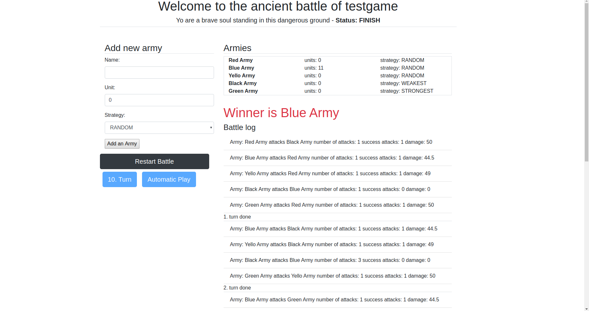

## BattleSimulation App

App is developed in laravel/vue, docker is used to build environment

- You need to have docker installed on your machine
- When download application, to start it, run command : docker-compose up
- To execute migration you need to enter into php container box: docker-compose exec php bash
- Run migrations: php artisan migrate
- From your host machine you need to install npm: npm install
- Run npm : npm run watch
- Open application on 127.0.0.1:8081

Screenshoot:

